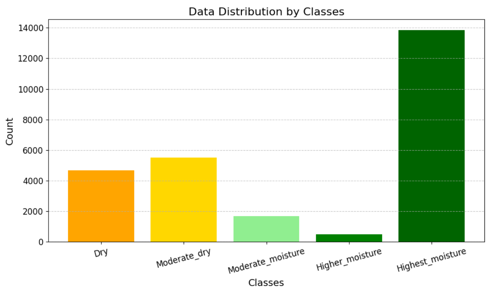
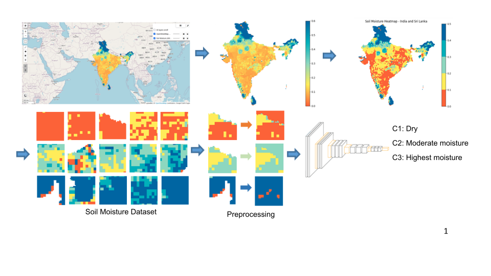
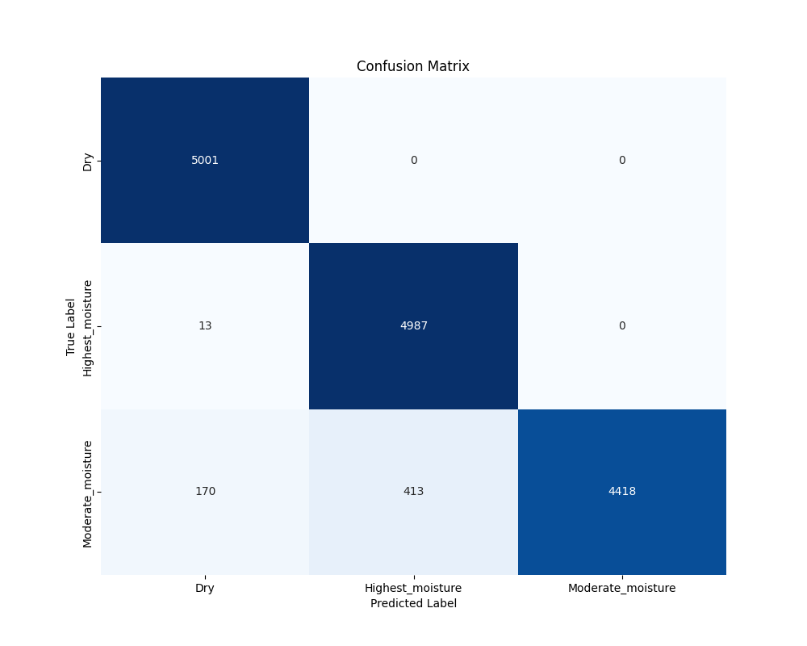
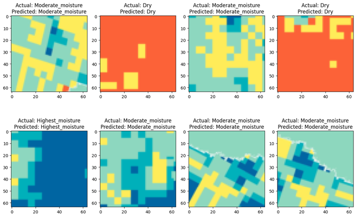
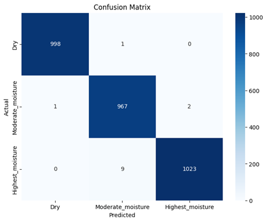

# Soil Moisture Detection and Prediction

Course Project of Foundations of Machine Learning (CS-725)

## Team Details

1. Hasmita Kurre : 23D0385
2. Chaitanya Shinge : 23M2116
3. Chanakya Vihar Challa : 24M2028
4. Rohit Kumar : 24M2029

## Team Contribution

* Hasmita Kurre
  * Dataset Preparation
  * CNN implementation on the dataset.

* Rohit Kumar
  * AlexNet implementation on the dataset.

* Chaitanya Shinge
  * ResNet50 implementation on the dataset.
  * Simple RGB Classifier implementation on the dataset

* Chanakya Vihar Challa
  * MobileNetV2 implementation on the dataset.

## Submission

* [GitHub Code](https://github.com/HasmitaKurre/CS725_FML/tree/main/FML_Project)
* [Soil Moisture Dataset](https://www.kaggle.com/datasets/hasmitakurre/nasa-soil-moisture-india-dataset)
* [Presentation](https://docs.google.com/presentation/d/1qWaXAnS5kQA2f15G3cFvWv3OZH8XOr8yN9_NEfvfiEM/view?usp=sharing)

## Problem Statement

> Develop a system for soil moisture detection to accurately predict soil moisture levels.

* We performed data preprocessing and sampling techniques to fine tune the data.
* For this project we had explored ML algorithms for Image Classification like CNN,
ResNet, AlexNet and MobileNet to detect the moisture and compared these
algorithms by calculating their accuracy and f1-score.

## Dataset

### Dataset Generation

We used satellite data from NASA-USDA on SMAP soil moisture profile provided using Google Maps API.
We saved snapshots from 2015 to 2020 and clipped the region of India.
We created patches of `396 x 396` dimensions of the region and assigned groundtruth label according to the intensity levels provided by the profiler.
Patches of a groundtruth label are stored in the directory named as that class label.

### Dataset Sampling

Due to such uneven #patches we selected three classes Dry, Moderate_Moisture and Highest_Moisture with considerable images to train on. Also, we had to downsample Highest_Moisture and upsample Moderate_Moisture class patches.

The following table shows the final dataset stats:

|Moisture Class|#Patches|
|:---:|:---:|
|Dry|5001|
|Moderate_Moisture|5001|
|Highest_Moisture|5000|

### Dataset Masking

The pixel coloring around Indian borders were white which created possibility of classifier to classify these images in meaningless class where patches have dominating white regions.
So, we masked(recolored) those regions with maximum amount of color intensity.

> The following diagram can help better visualize overall process:

### Dataset Split

* Training split: 80%
* Validation split: 20%

## Techniques Used

### Simple RGB Classifier

Since, we have to classify RGB images on the basis of predominant color in the image. We tried a simple RGB classifier without using ML-DL algorithms to have it as a benchmark to compare our models.

#### Algorithm

1. Take array form of image
2. Read each pixel and classify it into one of three classes.
3. Assign the class in which maximum pixels of the image are classified.

#### Classification criteria on a Pixel

Consider every `pixel` as tuple of RGB values: **(RED, BLUE, GREEN)** \
**RED, BLUE, GREEN ∈ [0, 255]**

* **Highest_moisture**
  * `BLUE/DARK BLUE` i.e. BLUE > RED & BLUE > GREEN & BLUE < 200
* **Dry**
  * `RED` i.e. RED > BLUE & RED > GREEN
  * `ORANGISH/REDISH` i.e. RED > BLUE & GREEN > BLUE & (RED < 200 | GREEN < 200)
* **Moderate_moisture**
  * `LIGHT BLUE` i.e. BLUE > RED & BLUE > GREEN & BLUE < 200
  * `GREEN` i.e. GREEN > RED and GREEN > BLUE
  * `YELLOW` i.e. RED > BLUE & RED > 200 & GREEN > BLUE & GREEN > 200
  * `ANY OTHER CASE`

This classification criteria is neither underfitting nor overfitting.

#### Classification Report

The classification criteria can be refined and finer details can be added as new criteria to reduce misclassifications

### CNN

### AlexNet

### MobileNetV2

### ResNet50

We used ResNet50 model proposed in [Deep Residual Learning for Image Recognition](https://doi.org/10.1109/CVPR.2016.90) research paper. We chose this ResNet50 among other variants considering our dataset.
We used `ResNet50` model provided by `keras` with slight adjustments. We overrided the final classifcation layers with two fully connected layers one with 1024 neurons and other with three neurons per class.
Using `accuracy` as metric, we used `ADAM optimizer` to minimize the `sparse categorical cross entropy loss` for every epoch. We ran model for `200 epochs`. Please check the `results/` for model performance throughout training and testing.

### Common Hyperparameters across Models

* Image Size: 96 x 96 x 3
* Epochs: 200 (but also using Early Stopping)
* Training Batch Size: 32

### Metrics Calculated

* Accuracy, F1-score, Recall, Precision using scikit-learn
* Confusion Matrix using seaborn

## Run

> Launch `jupyter server` on this directory

> Run the notebooks present in `src` folder in following order:

  1. Run [`1_Get_NASA_Raw_Data_FML.ipynb`](./src/1_Get_NASA_Raw_Data_FML.ipynb) jupyter notebook.
  2. Run [`2_Visualize_NASA_Raw_Data_FML.ipynb`](./src/2_Visualize_NASA_Raw_Data_FML.ipynb) jupyter notebook.
  3. Run [`3_Visualize_Images_NASA_Image_Data_FML.ipynb`](./src/3_Visualize_Images_NASA_Image_Data_FML.ipynb) jupyter notebook.
  4. Run [`4_Visualize_Images_NASA_Patch_Data_FML.ipynb`](./src/4_Visualize_Images_NASA_Patch_Data_FML.ipynb) jupyter notebook.
  5. Run [`5_Sampling_Classes.ipynb`](./src/5_Sampling_Classes.ipynb) jupyter notebook.
  6. Run [`6_Preprocesing_Classes.ipynb`](./src/6_Preprocesing_Classes.ipynb) jupyter notebook.
  7. Run [`7_CNN.ipynb`](./src/7_CNN.ipynb) jupyter notebook.
  8. Run [`8_Alexnet.ipynb`](./src/8_Alexnet.ipynb) jupyter notebook.
  9. Run [`9_MonbileNet.ipynb`](./src/9_MonbileNet.ipynb) jupyter notebook.
  10. Run [`10_ResNet50.ipynb`](./src/10_ResNet50.ipynb) jupyter notebook.
  11. Run [`11_Simple_RGB_Classifier.ipynb`](./src/11_Simple_RGB_Classifier.ipynb) jupyter notebook.

> You can find the results of Confusion matrix, Accuracy vs loss plot, Actual vs Prediction plot in `results/` folder

## Results

### Observations

Following images are some inference tests using trained CNN model:

* All classes are classified perfectly.
* Performance is consistent across each class.
* Model performs very well in classifying images without notable errors.
* Minimal misclassifications and good predictions.

This is the confusion matrix of the CNN model trained.

|Models|Test Accuracy|
|:---:|:---:|
|CNN|99.57%|
|ResNet50|99.66%|
|MobileNetV2|98.71%|
|AlexNet|97.42%|

## Conclusion

Our main aim is soil moisture detection to accurately predict soil moisture levels using
various machine learning algorithms and compare their accuracy to find the best
algorithm for the soil moisture detection.
